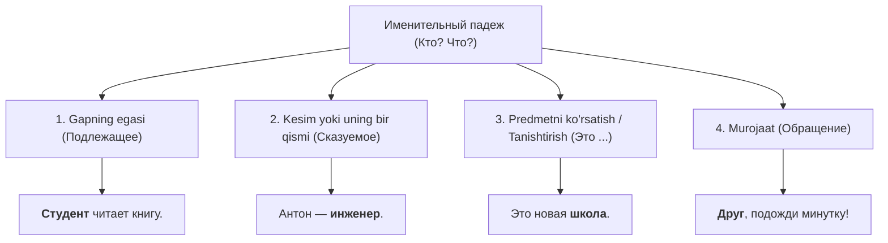

# 1-MAVZU: Именительный падеж (Bosh kelishik)

> **Mavzuning shiori:** *"Hamma narsaning asosi — bosh kelishik. Uni bilmasdan turib boshqa padejlarga qadam bosib boʻlmaydi!"*

---

## 1. Kirish: Именительный падеж nima va nega kerak?

**Именительный падеж (1-padej / Bosh kelishik)** — bu soʻzning lugʻatdagi boshlangʻich, oʻzgarmagan holati. Lugʻatni ochganingizda barcha otlar, sifatlar va olmoshlar aynan shu kelishikda turgan boʻladi.

Oʻzbek tilidagi **Bosh kelishik** bilan 100% mos keladi (qoʻshimchasiz shakl: *kitob, talaba, qizil qalam*).

### Asosiy savollari:
* **Кто?** — Kim? *(Tirik mavjudotlar uchun: odamlar, hayvonlar, qushlar)*
  * *Кто это? — Это **студент**.* (Bu kim? — Bu talaba.)
  * *Кто здесь работает? — Здесь работает **врач**.* (Bu yerda kim ishlaydi? — Bu yerda shifokor ishlaydi.)
* **Что?** — Nima? *(Jonsiz narsalar, tabiat hodisalari, tushunchalar uchun)*
  * *Что это? — Это **учебник**.* (Bu nima? — Bu darslik.)
  * *Что лежит на столе? — На столе лежит **письмо**.* (Stolda nima yotibdi? — Stolda xat yotibdi.)

---

## 2. Bosh kelishikning gapdagi asosiy vazifalari



1. **Gapning bosh harakatlanuvchi egasi (Подлежащее):**
   * *Студент* пишет упражнение. (Talaba mashq yozyapti.)
   * *Поезд* прибывает вовремя. (Poyezd oʻz vaqtida kelyapti.)
2. **Predmet yoki shaxsni tanishtirish / koʻrsatish:**
   * Это *мой брат*. (Bu mening akam.)
   * Вот *новая станция* метро. (Mana yangi metro bekati.)
3. **Ega haqidagi taʼrif (Kesim vazifasida):**
   * Мой отец — *врач*. (Mening otam — shifokor.)
   * Москва — *столица* России. (Moskva — Rossiyaning poytaxti.)

> [!NOTE]
> Bosh kelishik rus tilida **HECH QACHON predlog (old qoʻshimcha) bilan ishlatilmaydi**. Agar soʻz oldida predlog (в, на, с, к, о, из...) koʻrsangiz, bilingki u bosh kelishik emas!

---

## 3. Otlarning 3 ta jinsi (Род имён существительных)

Rus tilida har bir ot uchta jinsdan biriga tegishli. Bosh kelishikda jinsni toʻgʻri aniqlash boshqa barcha kelishiklarda toʻgʻri qoʻshimcha qoʻyishning **90% kaliti** hisoblanadi!

| Jins (Род) | Belgisi (Oxirgi harfi) | Jonli misollar | Jonsiz misollar | Oʻzbekcha maʼnosi |
| :--- | :--- | :--- | :--- | :--- |
| **Мужской род**<br>*(Erkak jinsi — "ОН")* | **Undosh harf**<br>**-й**<br>**-ь** (bir qismi)<br>*-а / -я (erkak maʼnosi)* | брат, студент<br>герой, музей<br>учитель, секретарь<br>папа, дядя, дедушка | стол, город, дом<br>трамвай, май, чай<br>словарь, рубль, день<br>мужчина, юноша | aka/uka, talaba, stol<br>qahramon, muzey, choy<br>oʻqituvchi, lugʻat, kun<br>dada, amaki, bobo |
| **Женский род**<br>*(Ayol jinsi — "ОНА")* | **-а**<br>**-я**<br>**-ия**<br>**-ь** (bir qismi) | сестра, подруга<br>тётя, балерина<br>Мария<br>мать, дочь | машина, книга, школа<br>земля, песня, неделя<br>аудитория, станция, армия<br>ночь, тетрадь, дверь, площадь | opa/singil, mashina, kitob<br>xola, yer, qoʻshiq, hafta<br>auditoriya, bekat, armiya<br>tun, daftar, eshik, maydon |
| **Средний род**<br>*(Oʻrta jins — "ОНО")* | **-о**<br>**-е**<br>**-ие**<br>**-мя** (istisno 10 ta soʻz) | дитя (bola)<br>—<br>—<br>— | окно, письмо, молоко, яблоко<br>море, поле, кафе<br>здание, общежитие, упражнение<br>время (vaqt), имя (ism) | deraza, xat, sut, olma<br>dengiz, dala, kafe<br>bino, yotoqxona, mashq<br>vaqt, ism |

### 💡 Miyaga quyish formulasi: -Ь (Yumshatish belgisi) bilan tugagan soʻzlar siri
`-ь` bilan tugagan otlar ham erkak, ham ayol boʻlishi mumkin. Ularni adashtirmaslik uchun quyidagi "layfxak" qoidalarni eslab qoling:

> [!TIP]
> 1. **-тель, -арь** bilan tugasa → deyarli 100% **Erkak jinsi** (*учитель, писатель, словарь, календарь*).
> 2. Oylar nomlari (**-брь, -ль, -нь, -ай**) → 100% **Erkak jinsi** (*январь, февраль, июнь, май*).
> 3. **-ость, -есть** bilan tugasa → 100% **Ayol jinsi** (*новость, радость, свежесть*).
> 4. **Shipillovchi undoshlar (ж, ч, ш, щ) + ь** bilan tugasa → 100% **Ayol jinsi** (*ночь, дочь, помощь, вещь*).

---

## 4. Koʻplik shakli (Множественное число)

Kitobning 215-sahifasida keltirilganidek, Bosh kelishikdagi otlarning koʻpligi quyidagi qonuniyatlar boʻyicha yasaladi:

### Otlarning koʻplik qoʻshimchalari jadvali

| Jins | Birlik (Ед.ч.) oxiri | Koʻplik (Мн.ч.) qoʻshimchasi | Birlik misol | Koʻplik misol | Qoida / Izoh |
| :--- | :--- | :--- | :--- | :--- | :--- |
| **Мужской** | Qattiq undosh | **-Ы** | студент, стол | студент**ы**, стол**ы** | Oddiy qattiq undoshlar ortidan |
| | **-й, -ь** | **-И** | музей, словарь | музе**и**, словар**и** | Yumshoq negiz |
| | **г, к, х, ж, ч, ш, щ** | **-И** | парк, врач, карандаш | парк**и**, врач**и**, карандаш**и** | **7 ta harf qoidasi!** (Hech qachon -ы yozilmaydi) |
| **Женский** | **-а** | **-Ы** | комната, газета | комнат**ы**, газет**ы** | Qattiq negiz |
| | **г, к, х, ж, ч, ш, щ + а** | **-И** | книга, ручка | книг**и**, ручк**и** | 7 ta harf qoidasi sababli |
| | **-я, -ь** | **-И** | песня, тетрадь | песн**и**, тетрад**и** | Yumshoq negiz |
| | **-ия** | **-ИИ** | аудитория, станция | аудитори**и**, станци**и** | -ия → -ии ga aylanadi |
| **Средний** | **-о** | **-А** | окно, письмо | окн**а**, письм**а** | Urgʻu koʻpincha oʻzgaradi |
| | **-е** | **-Я** | море, поле | мор**я**, пол**я** | Yumshoq oʻrta jins |
| | **-ие** | **-ИЯ** | здание, упражнение | здани**я**, упражнени**я** | -ие → -ия ga aylanadi |
| | **-мя** | **-ЕНА** | время, имя | врем**ена**, им**ена** | Negiz kengayadi (-ен-) |

> [!IMPORTANT]
> **Yodda saqlang: Koʻplikdagi eng muhim maxsus holatlar va istisnolar!**
> * **-а / -я urgʻuli qoʻshimchasini oluvchi erkak jinsidagi soʻzlar:**
>   * *дом → дом**а***
>   * *город → город**а***
>   * *глаз → глаз**а***
>   * *поезд → поезд**а***
>   * *профессор → профессор**а***
>   * *доктор → доктор**а***
>   * *вечер → вечер**а***
>   * *лес → лес**а***
>   * *адрес → адрес**а***
> * **Negizi oʻzgaruvchi va noqonuniy koʻpliklar:**
>   * *друг → друз**ья***
>   * *брат → брат**ья***
>   * *стул → стул**ья***
>   * *сын → сынов**ья***
>   * *дерево → дерев**ья***
>   * *лист → лист**ья***
>   * *человек → **люди*** (butunlay boshqa soʻz)
>   * *ребёнок → **дети*** (butunlay boshqa soʻz)

---

## 5. Sifatlarning bosh kelishikdagi oʻzgarishi (Имена прилагательные)

Sifat doimo oʻzi bogʻlangan otning **jinsi, soni va kelishigiga** 100% boʻysunadi:

| Jins va Son | Savoli | Asosiy qoʻshimchalar | Misollar (Qattiq negiz) | Misollar (Yumshoq / 7 harf) | Oʻzbekcha tarjimasi |
| :--- | :--- | :--- | :--- | :--- | :--- |
| **Мужской род** | **Какой?** | **-ый, -ой, -ий** | нов**ый** дом, молод**ой** человек | русск**ий** язык, син**ий** шарф | yangi uy, yosh yigit, rus tili, koʻk sharf |
| **Женский род** | **Какая?** | **-ая, -яя** | нов**ая** книга, молод**ая** девушка | русск**ая** песня, син**яя** ручка | yangi kitob, yosh qiz, rus qoʻshigʻi, koʻk ruchka |
| **Средний род** | **Какое?** | **-ое, -ее** | нов**ое** окно, молод**ое** дерево | русск**ое** слово, син**ее** море | yangi deraza, yosh daraxt, rus soʻzi, koʻk dengiz |
| **Множественное** | **Какие?** | **-ые, -ие** | нов**ые** дома, молод**ые** люди | русск**ие** книги, син**ие** шарфы | yangi uylar, yosh odamlar, rus kitoblari, koʻk sharflar |

---

## 6. Olmoshlarning bosh kelishikdagi shakllari (Местоимения)

### A) Kishilik olmoshlari (Личные местоимения)
* **Я** (men) | **Ты** (sen) | **Он** (u - erkak) | **Она** (u - ayol) | **Оно** (u - oʻrta/jonsiz)
* **Мы** (biz) | **Вы** (siz / sizlar) | **Они** (ular)

### B) Egalik olmoshlari (Притяжательные местоимения)

| Egalik shaxsi | Мужской (Чей?) | Женский (Чья?) | Средний (Чьё?) | Множественное (Чьи?) |
| :--- | :--- | :--- | :--- | :--- |
| **1-shaxs (Meniki)** | **мой** брат | **моя** сестра | **моё** письмо | **мои** друзья |
| **2-shaxs (Seniki)** | **твой** друг | **твоя** книга | **твоё** окно | **твои** вещи |
| **1-shaxs koʻplik (Bizniki)** | **наш** город | **наша** школа | **наше** общежитие | **наши** преподаватели |
| **2-shaxs koʻplik (Sizniki)** | **ваш** кабинет | **ваша** комната | **ваше** задание | **ваши** тетради |
| **3-shaxs (Uniki / Ularniki)** | **его** брат *(oʻzgarmas)* | **её** сестра *(oʻzgarmas)* | **их** дом *(oʻzgarmas)* | **их** книги *(oʻzgarmas)* |

### C) Koʻrsatish olmoshlari (Указательные местоимения)
* **Этот** (bu - erkak) | **Эта** (bu - ayol) | **Это** (bu - oʻrta) | **Эти** (bular - koʻplik)
* **Тот** (ana u - erkak) | **Та** (ana u - ayol) | **То** (ana u - oʻrta) | **Те** (ana ular - koʻplik)

---

## 7. Eng koʻp qilinadigan xatolar va tuzoqlar

```
❌ Noto'g'ri: Мой папа красивая.
✅ To'g'ri:   Мой папа красивый.
👉 Izoh: "Папа" soʻzi -а bilan tugasa ham maʼnosi erkak kishi, shuning uchun sifat erkak jinsida (красивый) boʻlishi shart!

❌ Noto'g'ri: Вкусное кофе.
✅ To'g'ri:   Вкусный кофе.
👉 Izoh: "Кофе" soʻzi chet tilidan kirgan mashhur istisno — u har doim ERKAK jinsida!

❌ Noto'g'ri: В городе есть новые домах.
✅ To'g'ri:   В городе есть новые дома.
👉 Izoh: Bosh kelishik koʻpligi "дома", "-ах" esa 6-padej koʻpligi. Bosh kelishikda qoʻshimcha -а boʻladi.
```

---

## 8. Amaliy mashqlar va oʻz-oʻzini tekshirish

### Mashq: Qavslarni ochib, soʻzlarni Bosh kelishik koʻplik shakliga oʻtkazing:
1. Здесь живут мои (друг) и (подруга).
2. На столе лежат новые (учебник) и синие (ручка).
3. В центре города строятся высокие (здание) и большие (дом).
4. В аудитории сидят иностранные (студент) и молодые (преподаватель).
5. На полке стоят русско-узбекские (словарь).

<details>
<summary><b>🔍 Toʻgʻri javoblarni tekshirish (ustiga bosing)</b></summary>

1. Здесь живут мои **друзья** и **подруги**.
2. На столе лежат новые **учебники** и синие **ручки**.
3. В центре города строятся высокие **здания** и большие **дома**.
4. В аудитории сидят иностранные **студенты** и молодые **преподаватели**.
5. На полке стоят русско-узбекские **словари**.
</details>

---

## 9. Xulosa: Eslab qolish uchun 5 ta oltin qoida

- [x] **1. Bosh kelishik — boshlangʻich nuqta:** Barcha soʻzlar lugʻatda shu koʻrinishda boʻladi, hech qanday predlog qabul qilmaydi.
- [x] **2. Jins — oxirgi harfga bogʻliq:** Undosh → Erkak, -а/-я → Ayol, -о/-е → Oʻrta.
- [x] **3. 7 ta harf qoidasi:** `г, к, х, ж, ч, ш, щ` harflaridan keyin koʻplikda hech qachon **-ы** yozilmaydi, faqat **-и** boʻladi.
- [x] **4. Sifat va olmoshlar otga boʻysunadi:** Ot qaysi jins va sonda boʻlsa, uning oldidagi soʻz ham aynan shu shaklga kiradi (*новый студент, новая студентка, новое общежитие, новые студенты*).
- [x] **5. Maxsus koʻpliklarni yodlang:** *дом → дома, город → города, друг → друзья, человек → люди, ребёнок → дети*.
