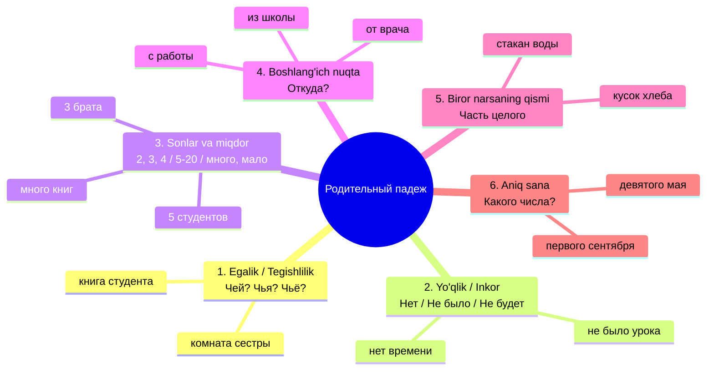

# 2-MAVZU: Родительный падеж (Qaratqich, Chiqish va Inkor kelishigi)

> **Mavzuning shiori:** *"Rus tilining eng qudratli va koʻp qirrali kelishigi! 'Kimning?', 'Nimaning?', 'Yoʻq', 'Qayerdan?' va barcha sonlar aynan shu kelishikda birlashadi."*

---

## 1. Kirish: Родительный падеж nima va nega kerak?

**Родительный падеж (2-padej)** — rus tilida eng keng qoʻllaniladigan kelishiklardan biri. Oʻzbek tilidagi bir vaqtning oʻzida bir nechta kelishik vazifasini bajaradi:
1. **Qaratqich kelishigi (-ning):** *книга студента* (talaba**ning** kitobi).
2. **Chiqish kelishigi (-dan):** *приехать из Москвы* (Moskva**dan** kelmoq).
3. **Inkor / Yoʻqlik (yoʻq):** *у меня нет времени* (menda vaqt **yoʻq**).
4. **Miqdor va hisob:** *два студента, пять рублей* (ikki talaba, besh soʻm).

### Asosiy savollari:
* **Кого?** — Kimning? Kimni (yoʻq)? Kimdan? *(Tirik shaxslar uchun)*
  * *Кого нет на уроке? — Нет **Антона**.* (Darsda kim yoʻq? — Anton yoʻq.)
  * *Чей это сын? — Это сын **профессора**.* (Bu kimning oʻgʻli? — Professorning oʻgʻli.)
* **Чего?** — Nimaning? Nimani (yoʻq)? Nimadan? *(Jonsiz narsalar uchun)*
  * *Чего здесь нет? — Здесь нет **словаря**.* (Bu yerda nima yoʻq? — Lugʻat yoʻq.)
  * *Центр чего? — Центр **города**.* (Nimaning markazi? — Shaharning markazi.)
* **Откуда?** — Qayerdan?
  * *Откуда вы приехали? — Я приехал **из Самарканда**.* (Qayerdan keldingiz? — Samarqanddan keldim.)
* **Чей? Чья? Чьё? Чьи?** — Kimning?
* **Сколько?** — Qancha?

---

## 2. Родительный падеж qachon ishlatiladi? (6 ta asosiy vaziyat)



### 1) Egalik va mansublik (Чей? Чья? Чьё? Чьи? — -ning)
Rus tilida "-ning" qoʻshimchasi yoʻq. Uning oʻrniga **egasi boʻlgan soʻz 2-padejga** qoʻyiladi va doim oʻzi tegishli soʻzdan KEYIN keladi:
* *Учебник (kimning?) **студента**.* — Talabaning darsligi.
* *Машина (kimning?) **отца**.* — Otamning mashinasi.
* *Улица (nimaning?) **города**.* — Shaharning koʻchasi.

### 2) Yoʻqlik va inkor: НЕТ, НЕ БЫЛО, НЕ БУДЕТ
Birovda yoki biror joyda biror narsa **yoʻqligini** aytish uchun ega 2-padejga oʻtadi:
* **Hozirgi zamon:** *У меня нет (nimam yoʻq?) **словаря** / **времени**.* (Lugʻatim / vaqtim yoʻq.)
* **Oʻtgan zamon:** *Вчера не было (nima boʻlmadi?) **урока** / **экскурсии**.* (Kecha dars / ekskursiya boʻlmadi.)
* **Kelasi zamon:** *Завтра не будет (nima boʻlmaydi?) **дождя** / **собрания**.* (Ertaga yomgʻir / majlis boʻlmaydi.)

> [!IMPORTANT]
> **Bor (Есть) vs Yoʻq (Нет) formulasi:**
> * Bor boʻlsa → **1-padej (Bosh kelishik):** *У меня есть брат (1-п).*
> * Yoʻq boʻlsa → **2-padej (Родительный):** *У меня нет брат**а** (2-п).*

### 3) Sonlar va miqdor bilan (Hisob formulasi)
Bu rus tilining eng muhim qoidalaridan biri! Kitobning 108 va 219-sahifalaridagi formula:

| Miqdor / Son | Qaysi kelishik va son qoʻyiladi? | Jonli misollar |
| :--- | :--- | :--- |
| **1** (*один, одна, одно*) | **Именительный падеж (1-п, birlik)** | один студент, одна книга, одно письмо |
| **2, 3, 4** (*два, три, четыре*) va oxiri 2, 3, 4 bilan tugaganlar (*22, 33...*) | **Родительный падеж (2-п, BIRLIK!)** | 2 студент**а**, 3 книг**и**, 4 письм**а** |
| **5 — 20, 0** va oxiri 5, 6, 7, 8, 9, 0 bilan tugaganlar | **Родительный падеж (2-п, KOʻPLIK!)** | 5 студент**ов**, 6 книг, 10 писем |
| **много, мало, сколько, несколько** | **Родительный падеж (2-п, KOʻPLIK)** | много студент**ов**, сколько книг, мало писем |

### 4) Qayerdan? (Откуда?) — Boshlangʻich nuqta (ИЗ, С, ОТ)
Qayerdan kelayotganingizni aytish uchun 2-padej predloglari ishlatiladi. Bu yerda **Antonomik juftliklar qoidasi** ishlaydi:

| Qayerga? (Куда? 4-п) | Qayerda? (Где? 6-п) | Qayerdan? (Откуда? 2-п) | Misollar |
| :--- | :--- | :--- | :--- |
| **В** (ichiga) | **В** (ichida) | **ИЗ** (ichidan) | в школу → в школе → **из школы**<br>в Ташкент → в Ташкенте → **из Ташкента** |
| **НА** (ustiga/tadbirlarga) | **НА** (ustida/tadbirlarda) | **С** (ustidan/tadbirlardan) | на работу → на работе → **с работы**<br>на вокзал → на вокзале → **с вокзала** |
| **К** (shaxs huzuriga) | **У** (shaxs huzurida) | **ОТ** (shaxs huzuridan) | к врачу → у врача → **от врача**<br>к другу → у друга → **от друга** |

---

## 3. Otlarning qoʻshimchalari jadvali (Окончания существительных)

### A) Birlik shakli (Единственное число)

| Jins (Род) | Bosh kelishik (1-п) | 2-padej qoʻshimchasi | Misollar (1-п → 2-п) | Oʻzbekcha maʼnosi |
| :--- | :--- | :--- | :--- | :--- |
| **Мужской** | Qattiq undosh<br>**-й**<br>**-ь** | **-А**<br>**-Я**<br>**-Я** | студент → студент**а**, стол → стол**а**<br>музей → музе**я**, трамвай → трамва**я**<br>преподаватель → преподавател**я**, словарь → словар**я** | talabaning, stolning<br>muzeyning, tramvayning<br>oʻqituvchining, lugʻatning |
| **Средний** | **-о**<br>**-е**<br>**-ие**<br>**-мя** | **-А**<br>**-Я**<br>**-ИЯ**<br>**-ЕНИ** | окно → окн**а**, место → мест**а**<br>море → мор**я**, поле → пол**я**<br>здание → здани**я**, общежитие → общежити**я**<br>время → врем**ени**, имя → им**ени** | derazaning, joyning<br>dengizning, dalaning<br>binoning, yotoqxonaning<br>vaqtning, ismning |
| **Женский** | **-а**<br>**-я**<br>**-ь**<br>**-ия** | **-Ы** (yoki -И)<br>**-И**<br>**-И**<br>**-ИИ** | комната → комнат**ы**, сестра → сестр**ы**<br>деревня → деревн**и**, неделя → недел**и**<br>тетрадь → тетрад**и**, площадь → площад**и**<br>аудитория → аудитори**и**, станция → станци**и** | xonaning, opaning<br>qishloqning, haftaning<br>daftarning, maydonning<br>auditoriyaning, bekatning |

> [!TIP]
> **Erkak va Oʻrta jins egizaklar!**
> Eʼtibor bering: 2-padejda erkak va oʻrta jinsdagi otlar **bir xil** qoʻshimcha oladi: qattiq boʻlsa **-А**, yumshoq boʻlsa **-Я** (*студента, окна; музея, моря*)!

---

### B) Koʻplik shakli (Множественное число — Kitob 219-bet)
Bu mavzuning eng koʻp eʼtibor talab qiladigan qismi:

| Jins (Род) | Asosiy belgi | Koʻplik qoʻshimchasi (2-п) | Birlik (1-п) | Koʻplik (2-п) | Misol jumlada |
| :--- | :--- | :--- | :--- | :--- | :--- |
| **Мужской** | Qattiq undosh<br>**-й**<br>**-ь**<br>**-ж, -ч, -ш, -щ** | **-ОВ**<br>**-ЕВ**<br>**-ЕЙ**<br>**-ЕЙ** | студент, дом<br>музей, герой<br>словарь, рубль<br>врач, карандаш, нож | 5 студент**ов**, 5 дом**ов**<br>много музе**ев**, геро**ев**<br>10 словар**ей**, рубл**ей**<br>много врач**ей**, карандаш**ей** | У нас много студентов.<br>Нет свободных домов.<br>Сто рублей.<br>Купил пять карандашей. |
| **Женский** | **-а** (qattiq)<br>**-я** (yumshoq)<br>**-ь** (yumshoq)<br>**-ия** | **Nol qoʻshimcha (baza qoladi)**<br>**-Ь** (yoki nol)<br>**-ЕЙ**<br>**-ИЙ** | книга, комната<br>деревня, неделя<br>тетрадь, площадь<br>аудитория, станция | много книг (a tushib qoladi)<br>много деревень, недель<br>нет тетрад**ей**, площад**ей**<br>много аудитор**ий**, станц**ий** | Нет интересных книг.<br>Прошло пять недель.<br>Купил пачку тетрадей.<br>Около станций метро. |
| **Средний** | **-о**<br>**-е**<br>**-ие** | **Nol qoʻshimcha**<br>**-ЕЙ**<br>**-ИЙ** | место, дело, окно<br>море, поле<br>здание, упражнение | много мест, дел, ок**он**<br>много мор**ей**, пол**ей**<br>много здан**ий**, упражнен**ий** | Нет свободных мест.<br>Берег тёплых морей.<br>Сделал много упражнений. |

> [!WARNING]
> **Yuguruvchi unlilar siri (Беглые гласные):**
> Ayol va oʻrta jinsdagi soʻzlar oxiridagi -а / -о tushib qolganda, soʻz oxirida ketma-ket ikki undosh qolib talaffuz qiyinlashsa, oraga **-о-** yoki **-е-** tushadi:
> * *ручка → много руч**е**к*
> * *студентка → много студент**о**к*
> * *девушка → много девуш**е**к*
> * *окно → много ок**о**н*
> * *письмо → много пис**е**м*

---

## 4. Sifatlarning 2-padejdagi oʻzgarishi (Прилагательные)

| Jins va Son | Savoli | Qoʻshimchasi | Qattiq negiz | Yumshoq negiz / 7 harf | Talaffuz qoidasi |
| :--- | :--- | :--- | :--- | :--- | :--- |
| **Мужской** | **Какого?** | **-ого / -его** | нов**ого** студента | син**его** карандаша, русск**ого** языка | **-ого / -его** dagi `г` harfi **"В"** deb oʻqiladi! *(novova, sineva)* |
| **Средний** | **Какого?** | **-ого / -его** | нов**ого** окна | син**его** моря, хорош**его** общежития | **-ого / -его** dagi `г` harfi **"В"** deb oʻqiladi! |
| **Женский** | **Какой?** | **-ой / -ей** | нов**ой** книги | русск**ой** песни, син**ей** тетради | Barcha no-bosh padejlarda ayol sifatlari **-ой / -ей** |
| **Множественное** | **Каких?** | **-ых / -их** | нов**ых** книг | русск**их** студентов, син**их** шарфов | Koʻplikda hamma jins uchun bir xil |

---

## 5. Olmoshlarning 2-padejdagi shakllari (Местоимения)

### A) Kishilik olmoshlari (Личные местоимения)
Predloglardan keyin (у, для, от, без...) 3-shaxs olmoshlari oldiga **Н** harfi qoʻshiladi:

| 1-padej (Кто?) | 2-padej (Кого?) | Predlog bilan (У кого?) | Oʻzbekcha maʼnosi |
| :--- | :--- | :--- | :--- |
| **Я** | меня | **у меня** | menda (mening huzurimda) |
| **Ты** | тебя | **у тебя** | senda |
| **Он** | его *(yevo)* | **у него** *(u nevo)* | unda (erkak) |
| **Она** | её *(yeyo)* | **у неё** *(u neyo)* | unda (ayol) |
| **Оно** | его *(yevo)* | **у него** | unda (oʻrta) |
| **Мы** | нас | **у нас** | bizda |
| **Вы** | вас | **у вас** | sizda |
| **Они** | их | **у них** | ularda |

### B) Egalik va koʻrsatish olmoshlari (Притяжательные и указательные)

| Olmosh turi | Мужской / Средний (Какого?) | Женский (Какой?) | Множественное (Каких?) |
| :--- | :--- | :--- | :--- |
| **Mening** | мо**его** брата / письма | мо**ей** сестры | мо**их** друзей |
| **Sening** | тво**его** друга | тво**ей** подруги | тво**их** книг |
| **Bizning** | наш**его** города | наш**ей** школы | наш**их** учителей |
| **Sizning** | ваш**его** декана | ваш**ей** группы | ваш**их** заданий |
| **Uniki / Ularniki** | **его, её, их** *(oʻzgarmaydi!)* | **его, её, их** *(oʻzgarmaydi!)* | **его, её, их** *(oʻzgarmaydi!)* |
| **Bu (Этот)** | эт**ого** студента | эт**ой** студентки | эт**их** студентов |
| **Ana u (Тот)** | т**ого** дома | т**ой** комнаты | т**ех** домов |

---

## 6. Родительный падеж predloglari (Toʻliq xarita)

Kitobning 109-sahifasida keltirilgan eng muhim predloglar:

| Predlog | Maʼnosi | Misol | Oʻzbekcha tarjimasi |
| :--- | :--- | :--- | :--- |
| **У** | 1) huzurida (oldida)<br>2) da (egalik: bor/yoʻq) | Стоять **у** окна.<br>**У** меня нет машины. | Deraza oldida turmoq.<br>Menda mashina yoʻq. |
| **Около / Возле** | yaqinida, atrofida, chamasi | Жить **около** университета.<br>Ждать **около** двух часов. | Universitet yaqinida yashamoq.<br>Ikki soatcha kutmoq. |
| **Вокруг** | atrofida (aylana boʻylab) | Деревья растут **вокруг** дома. | Uy atrofida daraxtlar oʻsyapti. |
| **Напротив** | roʻparasida, qarshisida | Аптека находится **напротив** метро. | Dorixona metro roʻparasida joylashgan. |
| **Посреди** | oʻrtasida, markazida | Фонтан **посреди** парка. | Bogʻ oʻrtasidagi favvora. |
| **Из** | ichidan (chiqish) | Приехать **из** Ташкента. Выйти **из** комнаты. | Toshkentdan kelmoq. Xonadan chiqmoq. |
| **С (со)** | ustidan / tadbirdan | Вернуться **с** работы. Упасть **со** стола. | Ishdan qaytmoq. Stoldan tushib ketmoq. |
| **От** | huzuridan / dan (masofa) | Отойти **от** окна. Письмо **от** друга. | Derazadan nariroq turmoq. Doʻstning xati. |
| **До** | gacha (vaqt yoki masofa) | Работать **с** утра **до** вечера. Дойти **до** вокзала. | Ertalabdan kechgacha ishlamoq. Vokzalga yetib bormoq. |
| **После** | dan keyin (vaqt) | Отдыхать **после** работы. | Ishdan keyin dam olmoq. |
| **Без** | -siz (inkor) | Пить чай **без** сахара. Прийти **без** опоздания. | Shakarsiz choy ichmoq. Kechikmasdan kelmoq. |
| **Для** | uchun (maqsad) | Подарок **для** мамы. Учебник **для** иностранцев. | Onam uchun sovgʻa. Chet elliklar uchun darslik. |
| **Кроме** | dan tashqari | Все пришли, **кроме** Ахмеда. | Ahmeddan tashqari hamma keldi. |
| **Вместо** | oʻrniga | Сегодня физика **вместо** химии. | Bugun kimyo oʻrniga fizika. |
| **Из-за** | 1) ortidan (chiqish)<br>2) tufayli (salbiy sabab) | Солнце вышло **из-за** туч.<br>Опоздал **из-за** пробки. | Quyosh bulutlar ortidan chiqdi.<br>Tirbandlik tufayli kechikdim. |

---

## 7. Родительный падежни talab qiluvchi asosiy feʼllar

Kitobning 109-sahifasidagi feʼllar roʻyxati:
* **Бояться** *(кого? чего? — qoʻrqmoq):*
  * *Ребёнок боится темноты (2-п).* (Bola qorongʻulikdan qoʻrqadi.)
  * *Мы не боимся трудностей.* (Biz qiyinchiliklardan qoʻrqmaymiz.)
* **Желать / Пожелать** *(чего? кому? — tilamoq):*
  * *Желаю вам счастья, здоровья и успехов!* (Sizga baxt, sogʻlik va muvaffaqiyatlar tilayman!)
* **Добиваться / Добиться** *(чего? — erishmoq, yetishmoq):*
  * *Студент добился отличных результатов.* (Talaba aʼlo natijalarga erishdi.)
* **Просить / Попросить** *(чего? — soʻramoq):*
  * *Больной просит помощи и воды.* (Bemor yordam va suv soʻrayapti.)
* **Требовать / Потребовать** *(чего? — talab qilmoq):*
  * *Преподаватель требует внимания и тишины.* (Oʻqituvchi diqqat va sukunatni talab qilyapti.)

---

## 8. Eng koʻp qilinadigan xatolar va tuzoqlar

```
❌ Noto'g'ri: У меня нет брат.
✅ To'g'ri:   У меня нет брата (2-п).
👉 Izoh: "НЕТ" soʻzidan keyin kelgan ot har doim 2-padejda boʻlishi SHART!

❌ Noto'g'ri: Я приехал с Самарканда.
✅ To'g'ri:   Я приехал из Самарканда.
👉 Izoh: Shaharlar, davlatlar, binolar ichiga kiriladi (В Ташкент), shuning uchun chiqish "ИЗ" boʻladi (Из Ташкента). "С" faqat "НА" ga javob boʻlgan joylarda ishlatiladi (на завод → с завода).

❌ Noto'g'ri: У меня есть 5 рубля.
✅ To'g'ri:   У меня есть 5 рублей.
👉 Izoh: 2, 3, 4 dan keyin birlik (рубля), 5 dan 20 gacha esa koʻplik (рублей) boʻladi!
```

---

## 9. Amaliy mashqlar va oʻz-oʻzini tekshirish

### Mashq: Qavslar ichidagi soʻzlarni Родительный падежga qoʻying:
1. Вчера у нас не было (контрольная работа).
2. На столе лежит тетрадь (новый студент).
3. Мы вышли из (большая аудитория) и пошли на остановку.
4. В нашей группе учится двадцать (иностранный студент).
5. Отец купил килограмм (сахар) и литр (молоко).

<details>
<summary><b>🔍 Toʻgʻri javoblarni tekshirish (ustiga bosing)</b></summary>

1. Вчера у нас не было **контрольной работы**.
2. На столе лежит тетрадь **нового студента**.
3. Мы вышли из **большой аудитории** и пошли на остановку.
4. В нашей группе учится двадцать **иностранных студентов**.
5. Отец купил килограмм **сахара** и литр **молока**.
</details>

---

## 10. Xulosa: Eslab qolish uchun 5 ta oltin qoida

- [x] **1. "НЕТ" koʻrdingizmi — darhol 2-padej qoʻying:** *Нет брата, нет книги, нет времени.*
- [x] **2. Egalik formulasi (-ning):** Ruschada ikkinchi oʻrinda turadi: *дом отца* (otaning uyi).
- [x] **3. 2, 3, 4 → Birlik (2-п), 5-20 → Koʻplik (2-п):** *2 брата, но 5 братьев.*
- [x] **4. Antonomik chiqish tizimi:** *В → ИЗ*, *НА → С*, *К → ОТ*.
- [x] **5. Sifatlar qoʻshimchasi:** Erkak/oʻrta jinsda **-ого / -его** (*"В"* deb oʻqiladi: нового, синего), ayolda **-ой / -ей** (*новой, синей*).
