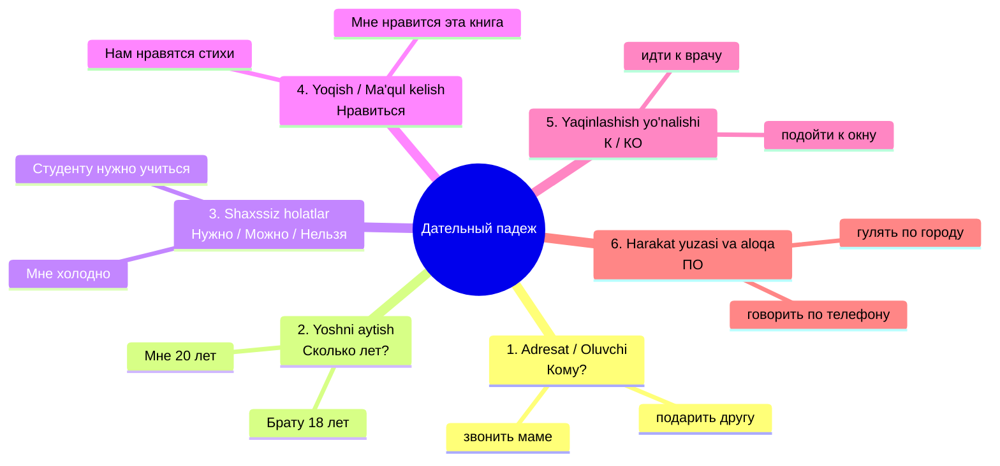

# 3-MAVZU: Дательный падеж (Joʻnalish va Adresat kelishigi)

> **Mavzuning shiori:** *"Kimgadir nimadir beryapsizmi, telefon qilyapsizmi, yoshingizni aytyapsizmi yoki 'menga yoqadi' demoqchimisiz? Unda marhamat — Дательный падеж xizmatingizda!"*

---

## 1. Kirish: Дательный падеж nima va nega kerak?

**Дательный падеж (3-padej)** — nomi aytib turibdiki, rus tilidagi **"дать" (bermoq)** feʼlidan olingan. Harakat kimga yoki nimaga qaratilgan boʻlsa, oʻsha shaxs yoki narsa aynan shu kelishikda keladi.

Oʻzbek tilidagi **Joʻnalish kelishigi (-ga qoʻshimchasi)** bilan deyarli toʻliq mos keladi (*doʻstim**ga** yordam berdim, onam**ga** gul sovgʻa qildim, un**ga** 20 yosh*).

### Asosiy savollari:
* **Кому?** — Kimga? *(Tirik shaxslar uchun)*
  * *Кому вы звоните? — Я звоню **маме**.* (Kimga qoʻngʻiroq qilyapsiz? — Onamga.)
  * *Кому вы дали словарь? — Я дал словарь **другу**.* (Lugʻatni kimga berdingiz? — Doʻstimga.)
* **Чему?** — Nimaga? *(Jonsiz narsalar, fanga, yoʻnalishga)*
  * *Чему вы радуетесь? — Я радуюсь **весне** и **успеху**.* (Nimadan/nimaga quvonyapsiz? — Bahorga va yutuqqa.)
* **К кому? / К чему?** — Kimning / nimaning oldiga (tomoniga)?
  * *Студент подошёл **к доске**.* (Talaba doska oldiga keldi.)
  * *Завтра я иду **к врачу**.* (Ertaga shifokor qabuliga boraman.)
* **По чему? / Где?** — Nima boʻylab? Qayerda?
  * *Мы гуляем **по парку**.* (Biz bogʻ boʻylab sayr qilyapmiz.)

---

## 2. Дательный падеж qachon ishlatiladi? (6 ta oltin qoida)



### 1) Harakatning adresati (Oluvchi shaxs: Кому?)
Harakat bevosita kimga yoʻnaltirilgan boʻlsa, oʻsha shaxs 3-padejga qoʻyiladi:
* *Отец подарил (kimga?) **сыну** часы.* (Ota oʻgʻliga soat sovgʻa qildi.)
* *Учитель объясняет (kimga?) **студентам** правило.* (Oʻqituvchi talabalarga qoidani tushuntiryapti.)
* *Я написал письмо (kimga?) **подруге**.* (Men dugonamga xat yozdim.)

### 2) Yoshni aytish (Возраст)
Rus tilida yosh oʻzbek tilidagidan tubdan farq qiladi:
* ❌ *Men 20 yoshdaman → Я 20 лет (NOTOʻGʻRI!)*
* ✅ **Menga 20 yosh boʻldi → МНЕ 20 лет (TOʻGʻRI!)**

| Shaxs | Ruscha ifodasi | Oʻzbekcha maʼnosi |
| :--- | :--- | :--- |
| **Мне** | Мне 21 год. | Menga 21 yosh. |
| **Тебе** | Сколько тебе лет? | Yoshing nechida? |
| **Ему** | Брату (ему) 25 лет. | Akamga 25 yosh. |
| **Ей** | Сестре (ей) 18 лет. | Singlimga 18 yosh. |
| **Нам / Вам / Им** | Нашим родителям 50 лет. | Ota-onamiz 50 yoshda. |

### 3) Shaxssiz modallik: НАДО, НУЖНО, МОЖНО, НЕЛЬЗЯ
Kimdir biror ishni qilishi shart, kerak, mumkin yoki mumkin emasligini aytganda, oʻsha **shaxs 3-padejda** turadi:
* ***Студенту* нужно** много читать. (Talaba koʻp oʻqishi kerak.)
* ***Мне* надо** пойти в аптеку. (Menga dorixonaga borishim zarur.)
* ***Детям* нельзя** смотреть этот фильм. (Bolalarga bu filmni koʻrish mumkin emas.)
* ***Вам* можно** войти. (Sizga kirish mumkin.)

### 4) Insonning jismoniy va ruhiy holati
Inson oʻzini qanday his qilayotganini ifodalash uchun ham Dativ ishlatiladi:
* ***Мне* холодно / жарко.** (Menga sovuq / issiq.)
* ***Ему* скучно.** (U zerikyapti.)
* ***Нам* весело.** (Bizga xushchaqchaq / maroqli.)
* ***Анне* трудно** говорить по-русски. (Annaga ruscha gapirish qiyin.)

### 5) НРАВИТЬСЯ / ПОНРАВИТЬСЯ feʼli (Miyaga quyish layfxaki!)
Rus tilida *"Men kitobni yaxshi koʻraman"* desangiz `Я люблю книгу (4-п)` boʻladi.
Lekin *"Menga bu kitob yoqadi"* demoqchi boʻlsangiz, **ega kitob boʻlib qoladi**, siz esa **3-padejga** oʻtasiz:

> [!IMPORTANT]
> **Нравится vs Нравятся qoidasi:**
> * Agar yoqayotgan narsa **birlikda** boʻlsa → **нравится**:
>   * *Мне нравится (что?) этот **город**.*
> * Agar yoqayotgan narsa **koʻplikda** boʻlsa → **нравятся**:
>   * *Мне нравятся (что?) эти **книги**.*

---

## 3. Otlarning qoʻshimchalari jadvali (Окончания существительных)

### A) Birlik shakli (Единственное число)

| Jins (Род) | Bosh kelishik (1-п) | 3-padej qoʻshimchasi | Misollar (1-п → 3-п) | Oʻzbekcha tarjimasi |
| :--- | :--- | :--- | :--- | :--- |
| **Мужской** | Qattiq undosh<br>**-й**<br>**-ь** | **-У**<br>**-Ю**<br>**-Ю** | студент → студент**у**, брат → брат**у**<br>музей → музе**ю**, герой → геро**ю**<br>учитель → учител**ю**, словарь → словар**ю** | talabaga, akaga<br>muzeyga, qahramonga<br>oʻqituvchiga, lugʻatga |
| **Средний** | **-о**<br>**-е**<br>**-ие**<br>**-мя** | **-У**<br>**-Ю**<br>**-ИЮ**<br>**-ЕНИ** | окно → окн**у**, письмо → письм**у**<br>море → мор**ю**, поле → пол**ю**<br>здание → здани**ю**, общежитие → общежити**ю**<br>время → врем**ени**, имя → им**ени** | derazaga, xatga<br>dengizga, dalaga<br>binoga, yotoqxonaga<br>vaqtga, ismga |
| **Женский** | **-а**<br>**-я**<br>**-ь**<br>**-ия** | **-Е**<br>**-Е**<br>**-И**<br>**-ИИ** | сестра → сестр**е**, мама → мам**е**<br>деревня → деревн**е**, земля → земл**е**<br>тетрадь → тетрад**и**, мать → матер**и**<br>аудитория → аудитори**и**, станция → станци**и** | opaga, onaga<br>qishloqqa, yerga<br>daftarga, onaga<br>auditoriyaga, bekatga |

> [!TIP]
> **Erkak va Oʻrta jins yana egizaklar!**
> 2-padejda boʻlgani kabi, 3-padejda ham erkak va oʻrta jins qoʻshimchalari mutlaqo bir xil: qattiq boʻlsa **-У**, yumshoq boʻlsa **-Ю** (*студенту, окну; герою, морю*)!

---

### B) Koʻplik shakli (Множественное число — Kitob 227-bet)
3-padejning koʻpligi — rus tilidagi eng oson va yoqimli qoidalardan biri. Barcha jinslar bir xil boʻlib ketadi:

| Barcha jinslar uchun (M, F, N) | Koʻplik qoʻshimchasi | Birlik (1-п) | Koʻplik (3-п) | Misol jumlada |
| :--- | :--- | :--- | :--- | :--- |
| **Qattiq negizlar** | **-АМ** | студент, книга, окно | студент**ам**, книг**ам**, окн**ам** | Преподаватель объясняет студент**ам** правило. |
| **Yumshoq negizlar (-й, -ь, -е, -я)** | **-ЯМ** | врач, учитель, аудитория, море | врач**ам**, учител**ям**, аудитори**ям**, мор**ям** | Мы благодарны нашим учител**ям**. |
| **Maxsus soʻzlar** | **-ЬЯМ / -АМ** | друзья, братья, дети, люди | друз**ьям**, брат**ьям**, дет**ям**, люд**ям** | Я всегда рад помочь своим друз**ьям**. |

---

## 4. Sifatlarning 3-padejdagi oʻzgarishi (Прилагательные)

| Jins va Son | Savoli | Qoʻshimchasi | Qattiq negiz | Yumshoq negiz / 7 harf | Misollar |
| :--- | :--- | :--- | :--- | :--- | :--- |
| **Мужской** | **Какому?** | **-ому / -ему** | нов**ому** другу | син**ему** карандашу, хорош**ему** человеку | Я позвонил новому другу. |
| **Средний** | **Какому?** | **-ому / -ему** | нов**ому** зданию | син**ему** морю, горяч**ему** молоку | Подойти к новому зданию. |
| **Женский** | **Какой?** | **-ой / -ей** | нов**ой** студентке | син**ей** ручке, русск**ой** культуре | Подарить цветы новой студентке. |
| **Множественное** | **Каким?** | **-ым / -им** | нов**ым** друзьям | син**им** шарфам, русск**им** писателям | Помогать новым студентам. |

---

## 5. Olmoshlarning 3-padejdagi shakllari (Местоимения)

### A) Kishilik olmoshlari (Личные местоимения)
Predloglardan keyin (к, по) 3-shaxs olmoshlari oldiga **Н** harfi qoʻshiladi:

| 1-padej (Кто?) | 3-padej (Кому?) | Predlog bilan (К кому?) | Misol jumla |
| :--- | :--- | :--- | :--- |
| **Я** | **мне** | **ко мне** | Он пришёл **ко мне** в гости. |
| **Ты** | **тебе** | **к тебе** | Я позвоню **тебе** вечером. |
| **Он** | **ему** | **к нему** | Врач подошёл **к нему**. |
| **Она** | **ей** | **к ней** | Брат поехал **к ней**. |
| **Оно** | **ему** | **к нему** | Солнце светит, тепло **ему**. |
| **Мы** | **нам** | **к нам** | Преподаватель подошёл **к нам**. |
| **Вы** | **вам** | **к вам** | Я хочу обратиться **к вам**. |
| **Они** | **им** | **к ним** | Мы поехали **к ним** на дачу. |

### B) Egalik va koʻrsatish olmoshlari

| Olmosh turi | Мужской / Средний (Какому?) | Женский (Какой?) | Множественное (Каким?) |
| :--- | :--- | :--- | :--- |
| **Mening** | мо**ему** другу / письму | мо**ей** сестре | мо**им** родителям |
| **Sening** | тво**ему** брату | тво**ей** подруге | тво**им** друзьям |
| **Bizning** | наш**ему** преподавателю | наш**ей** группе | наш**им** студентам |
| **Sizning** | ваш**ему** декану | ваш**ей** семье | ваш**им** коллегам |
| **Uniki / Ularniki** | **его, её, их** *(oʻzgarmaydi!)* | **его, её, их** *(oʻzgarmaydi!)* | **его, её, их** *(oʻzgarmaydi!)* |
| **Bu (Этот)** | эт**ому** мальчику | эт**ой** девочке | эт**им** людям |
| **Ana u (Тот)** | т**ому** студенту | т**ой** женщине | т**ем** детям |

---

## 6. Дательный падеж predloglari va ularning sirlari

Kitobning 147-sahifasiga koʻra, Dativ quyidagi maxsus predloglar bilan keladi:

### 1) Предлог "К / КО" (Yaqinlashish — Kimning/nimaning oldiga?)
Biror tirik insonga bormoqchi boʻlsangiz yoki narsaga yaqinlashsangiz, **К** predlogi ishlatiladi:
* *Идти **к врачу**.* (Shifokor qabuliga bormoq.)
* *Поехать в гости **к другу**.* (Doʻstnikiga mehmonga bormoq.)
* *Поезд подъехал **к станции**.* (Poyezd bekatga yaqinlashdi.)
* *Автомобиль подъехал **к дому**.* (Mashina uy oldiga kelib toʻxtadi.)

> [!NOTE]
> `Я`, `мне`, `все` soʻzlari oldidan **К** predlogi talaffuz oson boʻlishi uchun **КО** ga aylanadi:
> * *Приходи **ко мне**!* (Menikiga kel!)
> * *Подойти **ко всем**.* (Hammaga yaqinlashmoq.)

### 2) Предлог "ПО" (Sirt boʻylab, vosita, soha)
Rus tilidagi eng boy maʼnoli predloglardan biri:
* **Harakat yoʻnalishi (qayer boʻylab?):**
  * *Гулять **по парку**, идти **по улице**, ехать **по шоссе**.*
* **Aloqa va media vositalari:**
  * *Говорить **по телефону**, смотреть **по телевизору**, слушать **по радио**, связаться **по интернету**.*
* **Fan / Mutaxassislik / Soha:**
  * *Учебник **по математике**, лекция **по истории**, зачёт **по русскому языку**.*
* **Takroriylik (Qaysi kunlari?):**
  * *Занятия **по понедельникам**.* (Dushanba kunlari darslar.)

### 3) Boshqa muhim predloglar:
* **Благодаря** *(yordamida, tufayli — faqat ijobiy maʼnoda):*
  * *Благодаря помощи учителя я сдал экзамен.* (Oʻqituvchining yordami sharofati bilan imtihon topshirdim.)
* **Вопреки** *(qarshiligiga qaramay):*
  * *Вопреки плохой погоде мы пошли в горы.* (Yomon ob-havoga qaramasdan toqqa bordik.)
* **Навстречу** *(peshvoz, qarshisiga):*
  * *Он шёл навстречу ветру.* (U shamolga qarshi borardi.)
* **Согласно** *(muvofiq):*
  * *Согласно расписанию урок начинается в 9.* (Dars jadvaliga muvofiq soat 9 da boshlanadi.)

---

## 7. Дательный падежни talab qiluvchi feʼllar roʻyxati

Kitobning 147-sahifasidagi barcha asosiy feʼllar:

| Feʼllar juftligi (НСВ — СВ) | Maʼnosi | Misollar |
| :--- | :--- | :--- |
| **помогать — помочь** | yordam bermoq | Студент помогает **товарищу**. |
| **мешать — помешать** | xalaqit bermoq | Музыка мешает **мне** заниматься. |
| **советовать — посоветовать** | maslahat bermoq | Врач советует **больному** отдыхать. |
| **звонить — позвонить** | qoʻngʻiroq qilmoq | Вечером я позвоню **маме**. |
| **отвечать — ответить** | javob bermoq | Ученик отвечает **учителю**. |
| **давать — дать** | bermoq | Дай **мне**, пожалуйста, карандаш. |
| **дарить — подарить** | sovgʻa qilmoq | Брат подарил **сестре** книгу. |
| **писать — написать** | yozmoq | Мы пишем письма **родителям**. |
| **рассказывать — рассказать** | aytib bermoq | Гид рассказывает **туристам** о городе. |
| **объяснять — объяснить** | tushuntirmoq | Учитель объяснил **студентам** тему. |
| **верить — поверить** | ishonmoq | Я верю **твоему слову**. |
| **обещать — пообещать** | vaʼda bermoq | Сын обещал **отцу** хорошо учиться. |
| **разрешать — разрешить** | ruxsat bermoq | Декан разрешил **нам** сдать зачёт позже. |
| **запрещать — запретить** | taqiqlamoq | Врач запретил **больному** курить. |

---

## 8. Eng koʻp qilinadigan xatolar va tuzoqlar

```
❌ Noto'g'ri: Я звоню маму (4-п).
✅ To'g'ri:   Я звоню маме (3-п).
👉 Izoh: Oʻzbek tilida "Onamni yoqlayman / telefon qilaman" deyilishi mumkin, lekin ruschada har doim KIMGA: звонить кому? → маме!

❌ Noto'g'ri: Я 20 лет.
✅ To'g'ri:   Мне 20 лет.
👉 Izoh: Yosh aytishda shaxs Bosh kelishikda emas, Dativda boʻladi: Мне, тебе, ему, ей, нам, вам, им!

❌ Noto'g'ri: Я иду в врача.
✅ To'g'ri:   Я иду к врачу.
👉 Izoh: Insonning huzuriga borganingizda "В" predlogi emas, "К + 3-п" ishlatiladi!
```

---

## 9. Amaliy mashqlar va oʻz-oʻzini tekshirish

### Mashq: Qavslar ichidagi soʻzlarni Дательный падежga qoʻying:
1. Завтра исполняется двадцать лет (мой старший брат).
2. Преподаватель медленно объясняет грамматику (новые студенты).
3. Вчера мы с другом ходили в гости к (наш общий учитель).
4. Вечером туристы долго гуляли по (красивый вечерний город).
5. (Маленькая девочка) очень нравится читать сказки.

<details>
<summary><b>🔍 Toʻgʻri javoblarni tekshirish (ustiga bosing)</b></summary>

1. Завтра исполняется двадцать лет **моему старшему брату**.
2. Преподаватель медленно объясняет грамматику **новым студентам**.
3. Вчера мы с другом ходили в гости к **нашему общему учителю**.
4. Вечером туристы долго гуляли по **красивому вечернему городу**.
5. **Маленькой девочке** очень нравится читать сказки.
</details>

---

## 10. Xulosa: Eslab qolish uchun 5 ta oltin qoida

- [x] **1. Kimga berildi/qaratildi? → 3-padej:** *Дать другу, сказать сестре, звонить родителям.*
- [x] **2. Yosh faqat Dativda:** *Мне 19 лет, брату 24 года, бабушке 70 лет.*
- [x] **3. Modallik va holatlar:** *Мне нужно, студенту можно, детям нельзя, нам весело.*
- [x] **4. Inson tomon yoʻnalish:** *Идти к врачу, прийти ко мне.*
- [x] **5. Qoʻshimchalar formulasi:** Erkak/oʻrta jinsda **-У / -Ю**, ayolda **-Е / -И**, koʻplikda esa hamma jinslar uchun **-АМ / -ЯМ**.
