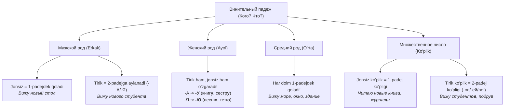

# 4-MAVZU: Винительный падеж (Tushum va Yoʻnalish kelishigi)

> **Mavzuning shiori:** *"Harakat bevosita kimga yoki nimaga oʻtmoqda? Qayerga ketyapsiz? Rus tilining eng joʻshqin va dinamik kelishigi — Винительный падеж bilan tanishing!"*

---

## 1. Kirish: Винительный падеж nima va nega kerak?

**Винительный падеж (4-padej / Tushum kelishigi)** — rus tilida eng koʻp ishlatiladigan kelishiklardan biri. U ikkita ulkan vazifani bajaradi:
1. **Toʻgʻridan-toʻgʻri harakat obyekti (Прямой объект):** Oʻzbek tilidagi **"-ni"** qoʻshimchasi (*kitob**ni** oʻqimoq, aka**mni** koʻrmoq*).
2. **Harakat yoʻnalishi (Направление движения):** Oʻzbek tilidagi **"Qayerga?" (-ga)** savoli (*maktab**ga** bormoq, dars**ga** shoshilmoq*).

### Asosiy savollari:
* **Кого?** — Kimni? *(Tirik shaxslar va jonivorlar uchun)*
  * *Кого вы ждёте? — Я жду **брата** и **подругу**.* (Kimni kutyapsiz? — Akamni va dugonamni.)
* **Что?** — Nimani? *(Jonsiz buyumlar, tushunchalar uchun)*
  * *Что вы читаете? — Я читаю **свежую газету**.* (Nimani oʻqiyapsiz? — Yangi gazetani.)
* **Куда?** — Qayerga? *(Yoʻnalish)*
  * *Куда идут студенты? — Студенты идут **в университет на лекцию**.* (Talabalar qayerga ketyapti? — Universitetga maʼruzaga.)
* **Когда? / Как долго?** — Qachon? Qancha vaqt? *(Vaqt oʻlchovlari)*
  * *Я учил эти слова **целый час**.* (Men bu soʻzlarni bir soat davomida yodladim.)

---

## 2. Tirik (Одушевлённые) va Jonsiz (Неодушевлённые) tushunchasi

Bu — Винительный падежning **ENG ASOSIY VA NOZIK SIRI**! Rus tilida 4-padejda soʻzlarning oʻzgarishi ularning **tirik** yoki **jonsiz** ekanligiga qarab belgilanadi:



> [!IMPORTANT]
> ### 💡 Miyaga quyish formulasi:
> 1. **Erkak jinsi (Мужской род):**
>    - Agar buyum jonsiz boʻlsa: `4-п = 1-п` *(Вижу стол, телефон, город)*. Hech narsa oʻzgarmaydi!
>    - Agar inson/jonivor (tirik) boʻlsa: `4-п = 2-п` *(Вижу студент**а**, брат**а**, учител**я**)*. Qoʻshimcha **-а / -я** oladi!
> 2. **Ayol jinsi (Женский род):**
>    - Tirikmi, jonsizmi — farqi yoʻq, **doimo oʻzgaradi**:
>      * **-а → -У** (*книга → книг**у**, мама → мам**у***)
>      * **-я → -Ю** (*земля → земл**ю**, тётя → тёт**ю***)
>      * **-ия → -ИЮ** (*аудитория → аудитори**ю***)
>      * Faqat **-ь** bilan tugagan ayol otlari oʻzgarmaydi (*тетрадь → тетрадь, площадь → площадь*).
> 3. **Oʻrta jins (Средний род):**
>    - Doimo jonsiz boʻlgani uchun `4-п = 1-п` *(окно → окно, море → море)*. Oʻzgarmaydi!
> 4. **Koʻplik (Множественное число):**
>    - Jonsiz boʻlsa: `4-п = 1-п koʻpligi` (*вижу новые машины, книги, столы*).
>    - Tirik boʻlsa: `4-п = 2-п koʻpligi` (*вижу студент**ов**, брат**ьев**, подру**г***).

---

## 3. Otlarning 4-padej qoʻshimchalari jadvali

### A) Birlik shakli (Единственное число)

| Jins va Turi | Bosh kelishik (1-п) | 4-padej shakli | Misollar (1-п → 4-п) | Ruscha jumla |
| :--- | :--- | :--- | :--- | :--- |
| **Мужской (Jonsiz)** | стол, журнал, музей | Oʻzgarmaydi (1-п) | стол, журнал, музей | Я купил **журнал** и **словарь**. |
| **Мужской (Tirik)** | студент, брат, учитель | **-А / -Я** (2-п) | студент**а**, брат**а**, учител**я** | Я встретил **студента** и **учителя**. |
| **Женский (Hammasi)** | книг**а**, сестр**а**<br>песн**я**, земл**я**<br>аудитори**я**<br>тетрадь, ночь | **-У**<br>**-Ю**<br>**-ИЮ**<br>oʻzgarmaydi | книг**у**, сестр**у**<br>песн**ю**, земл**ю**<br>аудитори**ю**<br>тетрадь, ночь | Я читаю **книгу** и жду **сестру**.<br>Мы слушаем **песню**.<br>Студенты вошли в **аудиторию**.<br>Я положил **тетрадь** в сумку. |
| **Средний (Jonsiz)** | окно, письмо, море | Oʻzgarmaydi (1-п) | окно, письмо, море | Я открыл **окно** и получил **письмо**. |

---

### B) Koʻplik shakli (Множественное число — Kitob 233-bet)

| Turi (Jonsiz / Tirik) | Bosh kelishik (1-п koʻplik) | 4-padej koʻplik shakli | Misollar va Jumlalar |
| :--- | :--- | :--- | :--- |
| **JONSIZ KOʻPLIK**<br>*(Barcha jinslar)* | столы, журналы<br>книги, газеты<br>окна, письма | **1-padej koʻpligi bilan bir xil!**<br>*(Oʻzgarishsiz qoladi)* | Я вижу красив**ые** город**а**.<br>Мы читаем русск**ие** книг**и**.<br>Рабочие строят нов**ые** здан**ия**. |
| **TIRIK KOʻPLIK**<br>*(Barcha jinslar)* | студенты, врачи<br>сёстры, подруги<br>друзья, братья | **2-padej koʻpligi bilan bir xil!**<br>*(-ов / -ев / -ей / nol)* | Я встретил иностранн**ых** студент**ов**.<br>Мы пригласили хорош**их** подру**г**.<br>Он ждёт сво**их** друз**ей**. |

---

## 4. Sifatlarning 4-padejdagi oʻzgarishi (Прилагательные)

| Jins / Holat | Savoli | Qoʻshimchasi | Misol | Izoh |
| :--- | :--- | :--- | :--- | :--- |
| **Мужской (Jonsiz)** | **Какой?** | **-ый / -ой / -ий** | нов**ый** дом, син**ий** костюм | 1-padejdek qoladi |
| **Мужской (Tirik)** | **Какого?** | **-ого / -его** | нов**ого** студента, син**его** кита | 2-padejdek boʻladi ("В" oʻqiladi) |
| **Женский (Har qanday)**| **Какую?** | **-ую / -юю** | нов**ую** книгу, син**юю** тетрадь | Hamisha **-ую / -юю** oladi! |
| **Средний (Jonsiz)** | **Какое?** | **-ое / -ее** | нов**ое** окно, син**ее** море | 1-padejdek qoladi |
| **Koʻplik (Jonsiz)** | **Какие?** | **-ые / -ие** | нов**ые** книги, син**ие** шарфы | 1-padej koʻpligi |
| **Koʻplik (Tirik)** | **Каких?** | **-ых / -их** | нов**ых** студентов, русск**их** врачей | 2-padej koʻpligi |

---

## 5. Olmoshlarning 4-padejdagi shakllari (Местоимения)

### A) Kishilik olmoshlari (Личные местоимения)
Kishilik olmoshlari odamlarni bildirgani uchun, 4-padejda ular **2-padej bilan 100% bir xil** boʻladi:

| 1-padej (Кто?) | 4-padej (Кого?) | Misol jumla | Oʻzbekcha tarjimasi |
| :--- | :--- | :--- | :--- |
| **Я** | **меня** | Ты слышишь **меня**? | Meni eshityapsanmi? |
| **Ты** | **тебя** | Я люблю **тебя**. | Men seni sevaman. |
| **Он** | **его** *(yevo)* | Мы ждём **его** здесь. | Biz uni (erkak) bu yerda kutyapmiz. |
| **Она** | **её** *(yeyo)* | Я часто вижу **её**. | Men uni (ayol) tez-tez koʻraman. |
| **Оно** | **его** | Мы положили **его** на стол. | Biz uni (xatni) stolga qoʻydik. |
| **Мы** | **нас** | Учитель похвалил **нас**. | Oʻqituvchi bizni maqtab qoʻydi. |
| **Вы** | **вас** | Я приглашаю **вас** на чай. | Sizni choyga taklif qilaman. |
| **Они** | **их** | Мы знаем **их** давно. | Biz ularni ancha vaqtdan beri taniymiz. |

### B) Egalik va koʻrsatish olmoshlari

| Egalik / Koʻrsatish | Мужской (Jonsiz / Tirik) | Женский (Какую?) | Средний (Какое?) | Koʻplik (Jonsiz / Tirik) |
| :--- | :--- | :--- | :--- | :--- |
| **Mening** | мой / мо**его** | мо**ю** | мо**ё** | мо**и** / мо**их** |
| **Sening** | твой / тво**его** | тво**ю** | тво**ё** | тво**и** / тво**их** |
| **Bizning** | наш / наш**его** | наш**у** | наш**е** | наш**и** / наш**их** |
| **Sizning** | ваш / ваш**его** | ваш**у** | ваш**е** | ваш**и** / ваш**их** |
| **Uniki / Ularniki** | **его, её, их** *(oʻzgarmaydi)* | **его, её, их** | **его, её, их** | **его, её, их** |
| **Bu (Этот)** | этот / эт**ого** | эт**у** | эт**о** | эт**и** / эт**их** |

---

## 6. Yoʻnalish siri: Qayerda? (ГДЕ? 6-п) vs Qayerga? (КУДА? 4-п)

Bu rus tilida chet elliklar eng koʻp adashadigan mavzudir. Kitobning 68-sahifasidagi formulaga qarang:

| Kelishik | Savoli | Feʼllar (Harakat holati) | Predlog va Qoʻshimcha | Misollar |
| :--- | :--- | :--- | :--- | :--- |
| **6-padej (Предложный)** | **ГДЕ?** *(Qayerda? — tinch holat)* | быть, жить, работать, учиться, находиться, стоять | **В / НА + -Е** | Я учусь **в школе**.<br>Книга лежит **на столе**.<br>Отец работает **на заводе**. |
| **4-padej (Винительный)** | **КУДА?** *(Qayerga? — harakat yoʻnalishi)* | идти, ехать, пойти, поехать, положить, поставить | **В / НА + -У / 1-п** | Я иду **в школу**.<br>Я кладу книгу **на стол**.<br>Отец едет **на завод**. |

> [!TIP]
> **Ayol jinsi eng yaxshi koʻrsatkich:**
> * *Где ты? — Я в комнат**е** (6-п, tinchlik).*
> * *Куда ты идёшь? — Я иду в комнат**у** (4-п, harakat).*

---

## 7. Vaqt ifodalashda 4-padej (Время в винительном падеже)

Kitobning 68-sahifasida vaqt maʼnosida 4-padejning 4 xil qoʻllanishi koʻrsatilgan:

1. **Jarayonning davomiyligi (hech qanday predlogsiz: Сколько времени?):**
   * *Я учил грамматику **всю неделю**.* (Hafta boʻyi oʻrgandim.)
   * *Мы жили в Москве **один год**.* (Bir yil yashadik.)
2. **Hafta kunlari (В + 4-п: В какой день?):**
   * **в понедельник**, **во вторник**, **в среду** *(ayol jinsi: среда → среду)*, **в четверг**, **в пятницу** *(пятница → пятницу)*, **в субботу** *(суббота → субботу)*, **в воскресенье**.
3. **Qancha vaqtdan keyin (ЧЕРЕЗ + 4-п):**
   * *Я приду **через час**.* (Bir soatdan keyin kelaman.)
   * *Экзамен будет **через неделю**.* (Imtihon bir haftadan soʻng boʻladi.)
4. **Qancha muddatga (НА + 4-п):**
   * *Он уехал в командировку **на месяц**.* (Bir oyga xizmat safariga ketdi.)
5. **Qancha vaqt ichida natijaga erishildi (ЗА + 4-п):**
   * *Студент перевёл статью **за один час**.* (Talaba maqolani bir soat ichida tarjima qilib boʻldi.)

---

## 8. Винительный падежни talab qiluvchi feʼllar (Oʻtimli feʼllar)

Kitobning 68–70-sahifalaridagi eng asosiy feʼllar roʻyxati:

| Feʼllar juftligi (НСВ — СВ) | Boshqaruv savoli | Misol jumla |
| :--- | :--- | :--- |
| **читать — прочитать** | что? (nimani?) | Я прочитал интересную **книгу**. |
| **писать — написать** | что? | Студенты пишут **диктант**. |
| **учить — выучить** | что? | Я выучил новое **правило**. |
| **покупать — купить** | что? | Мы купили новый **компьютер**. |
| **видеть — увидеть** | кого? что? | Вчера я видел твоего **брата** и эту **картину**. |
| **встречать — встретить** | кого? что? | В аэропорту мы встретили **делегацию**. |
| **любить — полюбить** | кого? что? | Я очень люблю свою **семью** и родной **город**. |
| **понимать — понять** | кого? что? | Студенты хорошо поняли эту **тему**. |
| **слушать — послушать** | что? | Мы слушаем классическую **музыку**. |
| **смотреть — посмотреть** | что? | Друзья смотрят новый **фильм**. |
| **звать — позвать** | кого? | Как тебя **зовут**? — Меня зовут Азиз. |
| **приглашать — пригласить** | кого? куда? | Друг пригласил **меня** на свой **день** рождения. |

---

## 9. Eng koʻp qilinadigan xatolar va tuzoqlar

```
❌ Noto'g'ri: Я вижу твой брат.
✅ To'g'ri:   Я вижу твоего брата.
👉 Izoh: "Брат" — tirik shaxs (одушевленный)! Erkak jinsidagi tirik otlar 4-padejda 2-padej qoʻshimchasini (-а/-я) oladi!

❌ Noto'g'ri: Я положил книгу на столе.
✅ To'g'ri:   Я положил книгу на стол.
👉 Izoh: "Положить" — harakat! Qayerga qoʻydim? → На стол (4-п). Stolda yotibdi desaгина "на столе" (6-п) boʻladi.

❌ Noto'g'ri: Я встретил красивые девушки.
✅ To'g'ri:   Я встретил красивых девушек.
👉 Izoh: Koʻplikdagi tirik otlar va ularning sifatlari 4-padejda 2-padej koʻpligiga oʻtadi: девушек (nol qoʻshimcha), красивых (-ых)!
```

---

## 10. Amaliy mashqlar va oʻz-oʻzini tekshirish

### Mashq: Qavslar ichidagi soʻzlarni Винительный падежga qoʻying:
1. Вечером я буду встречать в аэропорту (мой близкий друг) и (его сестра).
2. Завтра утром наша группа поедет на (интересная экскурсия).
3. В библиотеке студент взял (новый русско-английский словарь).
4. Преподаватель громко вызвал к доске (этот иностранный студент).
5. Я положил тетради и учебники в (свой школьный рюкзак).

<details>
<summary><b>🔍 Toʻgʻri javoblarni tekshirish (ustiga bosing)</b></summary>

1. Вечером я буду встречать в аэропорту **моего близкого друга** и **его сестру**.
2. Завтра утром наша группа поедет на **интересную экскурсию**.
3. В библиотеке студент взял **новый русско-английский словарь**. *(jonsiz — oʻzgarmaydi)*
4. Преподаватель громко вызвал к доске **этого иностранного студента**. *(tirik — 2-padejdek)*
5. Я положил тетради и учебники в **свой школьный рюкзак**. *(jonsiz — oʻzgarmaydi)*
</details>

---

## 11. Xulosa: Eslab qolish uchun 5 ta oltin qoida

- [x] **1. Tirik vs Jonsiz filtri:** Erkak jinsi va barcha koʻpliklarda tirik boʻlsa `4 = 2-п`, jonsiz boʻlsa `4 = 1-п`.
- [x] **2. Ayol jinsi har doim oʻzgaradi:** *-а → -У, -я → -Ю* (*книгу, песню*).
- [x] **3. Qayerga? (Куда?) — doim 4-padej:** *В школу, на работу, на выставку.*
- [x] **4. Oʻrta jins oʻzgarmaydi:** *окно, море, здание* (har doim 1-padej shaklida qoladi).
- [x] **5. Vaqt iboralari:** *в среду, через час, на неделю, целый день*.
