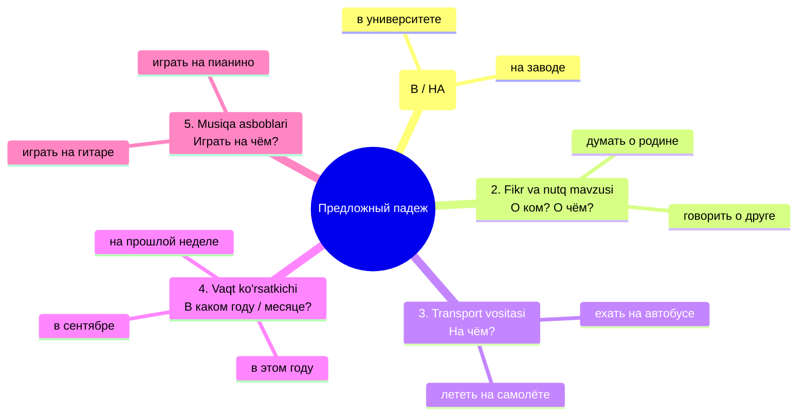
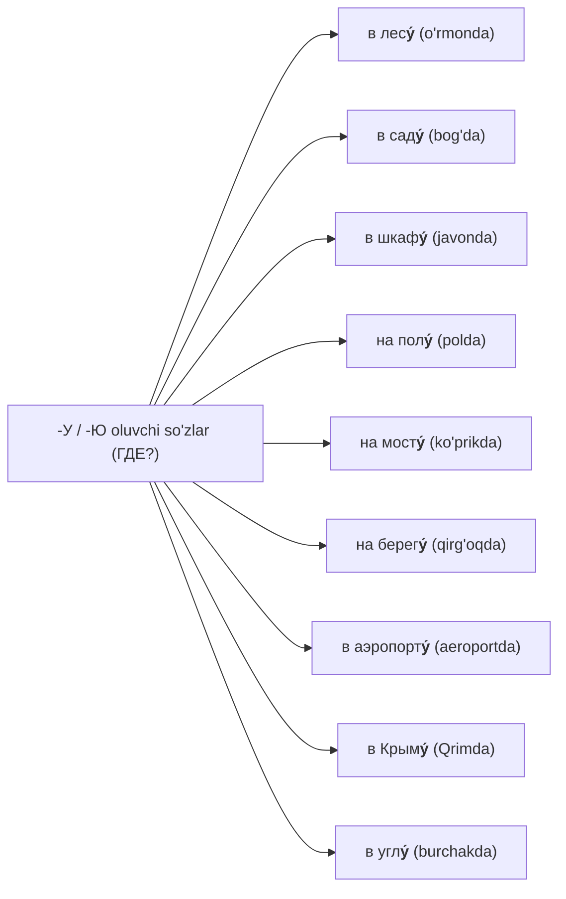

# 6-MAVZU: Предложный падеж (Oʻrin-payt va Fikr kelishigi)

> **Mavzuning shiori:** *"Rus tilida predlogsiz aslo yashay olmaydigan yagona kelishik! Qayerda yashaysiz? Kim haqida oʻylayapsiz? Qaysi transportda kelasiz? Bu savollarga Предложный падеж javob beradi!"*

---

## 1. Kirish: Предложный падеж nima va nega kerak?

**Предложный падеж (6-padej)** — nomi uning eng asosiy xususiyatini aytib turibdi: u rus tilida **faqat va faqat predloglar bilan** ishlatiladi! Boshqa hech qaysi kelishikda bunday qatʼiy talab yoʻq.

Oʻzbek tilidagi quyidagi tushunchalarga toʻgʻri keladi:
1. **Oʻrin-payt kelishigi (-da):** *в Ташкенте* (Toshkent**da**), *на работе* (ish**da**).
2. **Haqida / toʻgʻrisida:** *обо мне* (men **haqimda**), *о друге* (doʻstim **toʻgʻrisida**).
3. **Transport vositasi (-da):** *на автобусе* (avtobus**da**).

### Asosiy savollari:
* **Где?** — Qayerda? *(Oʻrin-joy)*
  * *Где вы учитесь? — Я учусь **в Политехническом университете**.* (Qayerda oʻqiysiz? — Politexnika universitetida.)
  * *Где лежит книга? — Книга лежит **на столе**.* (Kitob qayerda yotibdi? — Stol ustida.)
* **О ком?** — Kim haqida? *(Shaxslar toʻgʻrisida)*
  * *О ком вы говорите? — Мы говорим **о новом преподавателе**.* (Kim haqida gapiryapsiz? — Yangi oʻqituvchi haqida.)
* **О чём?** — Nima haqida? *(Mavzular, hodisalar toʻgʻrisida)*
  * *О чём эта книга? — Эта книга **об истории России**.* (Bu kitob nima haqida? — Rossiya tarixi haqida.)
* **На чём?** — Nimada? Qaysi transportda? Musiqiy asbobda?
  * *Мы едем **на поезде**.* (Biz poyezdda ketyapmiz.)
* **Когда?** — Qachon? *(Yil, oy, haftada)*
  * *Я родился **в 2000 году**.* (Men 2000 yilda tugʻilganman.)

---

## 2. Предложный падеж qachon ishlatiladi? (5 ta asosiy soha)



---

## 3. "В" va "НА" predloglarining sirlari (Qayerda? — Где?)

Kitobning 27–34-sahifalarida qaysi soʻzlar bilan **В**, qaysilari bilan **НА** ishlatilishi batafsil tushuntirilgan:

| Predlog | Qachon ishlatiladi? (Qoida) | Jonli misollar |
| :--- | :--- | :--- |
| **В (ВО)**<br>*(Ichida)* | 1. Devor bilan oʻralgan bino, xona, xonadonlar:<br>2. Shahar, tuman, viloyat, davlatlar:<br>3. Oʻrmon, bogʻ, parklar:<br>4. Geografik ichki hududlar: | **в комнате, в классе, в банке, в аптеке, в магазине**<br>**в Ташкенте, в Москве, в Узбекистане, в России**<br>**в парке, в саду, в лесу**<br>**в центре, в Сибири, в Азии, в Европе** |
| **НА**<br>*(Ustida, maydonda)* | 1. Ochiq maydon, koʻcha, tabiiy sirtlar:<br>2. Tadbirlar, jarayonlar, majlislar:<br>3. Korxonalar, bekatlar, orollar:<br>4. Dunyo tomonlari va qavatlar:<br>5. Togʻlar va daryo/koʻl qirgʻoqlari: | **на улице, на площади, на проспекте, на стадионе**<br>**на уроке, на лекции, на работе, на концерте, на выставке**<br>**на заводе, на фабрике, на вокзале, на почте, на Кубе**<br>**на севере, на юге, на востоке; на втором этаже**<br>**на Кавказе, на Урале; на берегу, на реке** |

> [!IMPORTANT]
> **Tadbirlar qoidasi (Miyaga quyish layfxaki):**
> Agar soʻz bino emas, balki biror **jarayon yoki tadbir** boʻlsa, har doim **НА** predlogi ishlatiladi:
> * *на уроке* (darsda)
> * *на лекции* (maʼruzada)
> * *на экзамене* (imtihonda)
> * *на собрании* (majlisda)
> * *на работе* (ishda — ish bu jarayon!)
> * *на концерте* (konsertda)
> * *на экскурсии* (ekskursiyada)

---

## 4. Maxsus "-У / -Ю" qoʻshimchasi (Oʻrin-joy istisnolari!)

Rus tilida erkak jinsidagi baʼzi otlar **oʻrin-joy maʼnosida** (Где?) odatiy `-е` oʻrniga har doim **urgʻuli -У / -Ю** qoʻshimchasini oladi (Kitob 28-bet):



> [!WARNING]
> **Tuzoqqa tushmang!**
> Bu soʻzlar faqat **oʻrin-joy (Где?)** maʼnosida `-у` oladi. Agar ular **fikr obyekti (О ком? О чём?)** boʻlib kelsa, odatiy **-Е** qaytib keladi!
> * *Дети гуляют **в лесу́** (Где? — oʻrmonda).*
> * *Мы читали интересную сказку **о ле́се** (О чём? — oʻrmon haqida).*
> * *Одежда висит **в шкафу́** (Где? — javonda).*
> * *Мы говорили **о новом шка́фе** (О чём? — yangi javon haqida).*

---

## 5. О vs ОБ vs ОБО predloglari siri

Nutq va fikr obyektida qaysi predlog qoʻyilishi soʻzning birinchi harfiga bogʻliq:

1. **О** — undosh harf bilan boshlangan soʻzlar oldidan:
   * *о **д**руге, о **к**ниге, о **М**оскве, о **с**емье.*
2. **ОБ** — unli harflar (**а, о, у, и, э**) bilan boshlangan soʻzlar oldidan:
   * *об **а**удитории, об **э**кзамене, об **и**нституте, об **о**пере, об **у**ниверситете.*
3. **ОБО** — fonetik qulaylik uchun faqat bir nechta soʻz oldidan:
   * ***обо мне*** (men haqimda)
   * ***обо всём*** (hamma narsa haqida)
   * ***обо всех*** (hamma haqida)

---

## 6. Otlarning 6-padej qoʻshimchalari jadvali

### A) Birlik shakli (Единственное число)

| Jins (Род) | 1-padej oxiri | 6-padej qoʻshimchasi | Misollar (1-п → 6-п) | Ruscha jumla |
| :--- | :--- | :--- | :--- | :--- |
| **Мужской** | Qattiq undosh<br>**-й**<br>**-ь**<br>**-ий** (maxsus) | **-Е**<br>**-Е**<br>**-Е**<br>**-И** | студент → о студент**е**<br>музей → в музе**е**<br>словарь → в словар**е**<br>санаторий → в санатори**и** | Я часто думаю о студент**е**.<br>Мы были в музе**е**.<br>Слово найдено в словар**е**.<br>Дедушка отдыхает в санатори**и**. |
| **Средний** | **-о**<br>**-е**<br>**-ие** (maxsus)<br>**-мя** | **-Е**<br>**-Е**<br>**-И**<br>**-ЕНИ** | окно → на окн**е**<br>море → на мор**е**<br>здание → в здани**и**<br>время → о врем**ени** | Цветы стоят на окн**е**.<br>Летом мы были на мор**е**.<br>Урок идёт в новом здани**и**.<br>Мы говорили о врем**ени**. |
| **Женский** | **-а**<br>**-я**<br>**-ь** (maxsus)<br>**-ия** (maxsus) | **-Е**<br>**-Е**<br>**-И**<br>**-ИИ** | школа → в школ**е**<br>деревня → в деревн**е**<br>тетрадь → в тетрад**и**<br>аудитория → в аудитори**и** | Сестра учится в школ**е**.<br>Бабушка живёт в деревн**е**.<br>Упражнение написано в тетрад**и**.<br>Студенты сидят в аудитори**и**. |

> [!TIP]
> **Deyarli hamma soʻz -E bilan tugaydi!**
> 6-padej birlik sonining goʻzalligi shundaki, 90% soʻzlar (erkak, ayol, oʻrta) birdek **-Е** oladi (*в столе, в окне, в комнате*).
> Faqat **3 ta guruh -И oladi**:
> 1. `-ия` (аудитор**ии**, станци**и**, Росси**и**)
> 2. `-ие` (здан**ии**, общежит**ии**, упражнен**ии**)
> 3. `-ь` ayol jinsi (тетрад**и**, площад**и**, ноч**и**)

---

### B) Koʻplik shakli (Множественное число — Kitob 242-bet)
Koʻplikda barcha jinslar uchun umumiy boʻlgan ikkita qoʻshimcha bor:

| Barcha jinslar uchun (M, F, N) | Koʻplik qoʻshimchasi | Birlik (1-п) | Koʻplik (6-п) | Misol jumla |
| :--- | :--- | :--- | :--- | :--- |
| **Qattiq negizlar** | **-АХ** | студент, книга, окно | о студент**ах**, в книг**ах**, на окн**ах** | В этих книг**ах** много картинок. |
| **Yumshoq negizlar (-й, -ь, -я, -е)** | **-ЯХ** | музей, словарь, аудитория, море | в музе**ях**, в словар**ях**, в аудитори**ях**, на мор**ях** | Занятия идут в светлых аудитори**ях**. |
| **Maxsus istisnolar** | **-ЬЯХ / -АХ** | друзья, братья, дети, люди | о друз**ьях**, о брат**ьях**, о дет**ях**, о люд**ях** | Мы заботимся о дет**ях**. |

---

## 7. Sifatlarning 6-padejdagi oʻzgarishi (Прилагательные)

| Jins va Son | Savoli | Qoʻshimchasi | Misollar (Qattiq / Yumshoq) | Ruscha jumla |
| :--- | :--- | :--- | :--- | :--- |
| **Мужской** | **О каком? / В каком?** | **-ом / -ем** | в нов**ом** доме, в русск**ом** музее, в син**ем** костюме | Мы живём в **новом доме**. |
| **Средний** | **О каком? / В каком?** | **-ом / -ем** | в нов**ом** здании, в син**ем** море, в хорош**ем** общежитии | Учиться в **новом здании**. |
| **Женский** | **О какой? / В какой?** | **-ой / -ей** | в нов**ой** школе, в син**ей** тетради, на русск**ой** песне | Написать в **синей тетради**. |
| **Множественное** | **О каких? / В каких?** | **-ых / -их** | в нов**ых** домах, в русск**их** книгах, в син**их** шарфах | Читать о **русских городах**. |

---

## 8. Olmoshlarning 6-padejdagi shakllari (Местоимения)

### A) Kishilik olmoshlari (Личные местоимения)

| 1-padej (Кто?) | 6-padej (О ком?) | Predlog bilan | Misol jumla |
| :--- | :--- | :--- | :--- |
| **Я** | мне | **обо мне** | Мои родители часто думают **обо мне**. |
| **Ты** | тебе | **о тебе** | Вчера мы говорили **о тебе**. |
| **Он / Оно** | нём | **о нём** | Мы посмотрели фильм и спорили **о нём**. |
| **Она** | ней | **о ней** | Друг рассказал мне **о ней**. |
| **Мы** | нас | **о нас** | Написали статью в газете **о нас**. |
| **Вы** | вас | **о вас** | Преподаватель спрашивал **о вас**. |
| **Они** | них | **о них** | Мы помним **о них** всегда. |

### B) Egalik va koʻrsatish olmoshlari

| Egalik / Koʻrsatish | Мужской / Средний (В каком?) | Женский (В какой?) | Koʻplik (В каких?) |
| :--- | :--- | :--- | :--- |
| **Mening** | в мо**ём** городе / письме | в мо**ей** комнате | в мо**их** тетрадях |
| **Sening** | в тво**ём** доме | в тво**ей** школе | в тво**их** словах |
| **Bizning** | в наш**ем** институте | в наш**ей** стране | в наш**их** планах |
| **Sizning** | в ваш**ем** кабинете | в ваш**ей** семье | в ваш**их** статьях |
| **Uniki / Ularniki** | **в его, в её, в их** *(oʻzgarmaydi!)* | **в его, в её, в их** | **в его, в её, в их** |
| **Bu (Этот)** | в эт**ом** году / здании | в эт**ой** книге | в эт**их** странах |
| **Ana u (Тот)** | в т**ом** месте | в т**ой** аудитории | в т**ех** городах |

---

## 9. Предложный падежни talab qiluvchi asosiy feʼllar

Kitobning 27-sahifasidagi boshqaruv feʼllari:

### A) Oʻrin-joy maʼnosidagi feʼllar (Где? — В / НА):
* **Жить** *(где? — yashamoq):* *Я живу в Ташкенте на улице Навои.*
* **Работать** *(где? — ishlamoq):* *Отец работает на заводе в цехе.*
* **Учиться** *(где? — oʻqimoq):* *Брат учится в университете на факультете физики.*
* **Находиться** *(где? — joylashgan boʻlmoq):* *Музей находится в центре на площади.*
* **Отдыхать** *(где? — dam olmoq):* *Летом мы отдыхали на море.*

### B) Fikr va nutq feʼllari (О ком? О чём? — О / ОБ / ОБО):
* **Думать — подумать** *(oʻylamoq):* *Я часто думаю о родине и о своей семье.*
* **Мечтать** *(orzu qilmoq):* *Студент мечтает об учёбе в аспирантуре.*
* **Говорить — сказать** *(gapirmoq):* *На уроке мы говорили о космосе.*
* **Рассказывать — рассказать** *(aytib bermoq):* *Гид рассказал туристам об истории музея.*
* **Вспоминать — вспомнить** *(eslamoq):* *Мы тепло вспоминали о школьных друзьях.*
* **Помнить** *(yodda saqlamoq):* *Всегда помни о своих родителях.*
* **Заботиться** *(gʻamxoʻrlik qilmoq):* *Родители заботятся о детях.*

---

## 10. Eng koʻp qilinadigan xatolar va tuzoqlar

```
❌ Noto'g'ri: Я живу в Ташкент.
✅ To'g'ri:   Я живу в Ташкенте (6-п).
👉 Izoh: "Qayerda?" (Где?) savoliga javob berganda barcha shahar va davlatlar 6-padejda -Е qoʻshimchasini oladi!

❌ Noto'g'ri: Мы гуляли в лесе.
✅ To'g'ri:   Мы гуляли в лесу.
👉 Izoh: Joy maʼnosida лес, сад, шкаф, пол, мост soʻzlari -У oladi!

❌ Noto'g'ri: Студенты сидят в аудиторие.
✅ To'g'ri:   Студенты сидят в аудитории.
👉 Izoh: "-ия" bilan tugagan soʻzlar 6-padejda -е emas, -и oladi: аудитория → в аудитории, Россия → в России!

❌ Noto'g'ri: Я еду на автобус.
✅ To'g'ri:   Я еду на автобусе.
👉 Izoh: Transport vositasi sifatida har doim 6-padej ishlatiladi: на автобусе, на метро, на поезде!
```

---

## 11. Amaliy mashqlar va oʻz-oʻzini tekshirish

### Mashq: Qavslar ichidagi soʻzlarni Предложный падежga qoʻying:
1. Моя семья сейчас живёт в (красивый древний Самарканд).
2. На уроке преподаватель подробно рассказал об (известный русский учёный).
3. Все наши студенты живут в (новое студенческое общежитие).
4. Зимой дети катались на лыжах в (зимний сосновый лес).
5. На прошлой (неделя) мы были на (интересный вечерний спектакль).

<details>
<summary><b>🔍 Toʻgʻri javoblarni tekshirish (ustiga bosing)</b></summary>

1. Моя семья сейчас живёт в **красивом древнем Самарканде**.
2. На уроке преподаватель подробно рассказал об **известном русском учёном**.
3. Все наши студенты живут в **новом студенческом общежитии** *(-ие → -ии)*.
4. Зимой дети катались на лыжах в **зимнем сосновом лесу** *(oʻrin-joy istisnosi: в лесу)*.
5. На прошлой **неделе** мы были на **интересном вечернем спектакле**.
</details>

---

## 12. Xulosa: Eslab qolish uchun 5 ta oltin qoida

- [x] **1. Predlogsiz mavjud boʻlmaydi:** Doim *В, НА, О (ОБ, ОБО), ПРИ* bilan keladi.
- [x] **2. 90% otlar -E bilan tugaydi:** *в столе, в окне, в школе.*
- [x] **3. Faqat 3 toifa -И oladi:** *-ия (в аудитории), -ие (в общежитии), -ь ayol (в тетради).*
- [x] **4. Oʻrin-joy istisnolari (-У):** *в лесу, в саду, в шкафу, на полу, на мосту, в аэропорту.*
- [x] **5. Tadbirlar doimo "НА" bilan:** *на уроке, на работе, на концерте, на собрании.*
