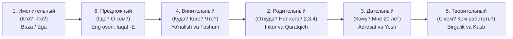

# Rus tili Padejlar tizimi (Предложно-падежная система русского языка)

> **Qoʻllanma asosi:** Н.Т. Мелех, И.И. Баранова — *"Русские падежи. Сборник упражнений"* (СПб.: Изд-во Политехн. ун-та).  
> **Mualliflik uslubi:** Oʻquvchining ongiga oʻrnashadigan, chuqur tahliliy va eng qulay oʻzbekcha tushuntirishlar bilan boyitilgan mukammal konspekt.

---

## 📌 Mundarija va Tezkor Navigatsiya

Har bir kelishik boʻyicha toʻliq va mukammal darsliklar bilan tanishish uchun quyidagi fayllarga oʻting:

| Tartib | Ruscha nomi | Oʻzbekcha nomi | Asosiy savollari | Darslikka havola |
| :---: | :--- | :--- | :--- | :--- |
| **1-падеж** | **Именительный падеж** | Bosh kelishik | Кто? Что? | [01_Именительный_падеж.md](01_Именительный_падеж.md) |
| **2-падеж** | **Родительный падеж** | Qaratqich / Chiqish | Кого? Чего? Откуда? Сколько? | [02_Родительный_падеж.md](02_Родительный_падеж.md) |
| **3-падеж** | **Дательный падеж** | Joʻnalish / Adresat | Кому? Чему? К кому/чему? | [03_Дательный_падеж.md](03_Дательный_падеж.md) |
| **4-падеж** | **Винительный падеж** | Tushum / Yoʻnalish | Кого? Что? Куда? Когда? | [04_Винительный_падеж.md](04_Винительный_падеж.md) |
| **5-падеж** | **Творительный падеж** | Qurol / Birgalik | Кем? Чем? С кем? С чем? | [05_Творительный_падеж.md](05_Творительный_падеж.md) |
| **6-падеж** | **Предложный падеж** | Oʻrin-payt / Haqida | О ком? О чём? Где? На чём? | [06_Предложный_падеж.md](06_Предложный_падеж.md) |

---

## 🗺️ Rus tilida padejlarni oʻrganishning tabiiy ketma-ketligi

Chet elliklarga rus tilini oʻrgatish (РКИ — Русский как иностранный) metodikasi boʻyicha kelishiklar 1 dan 6 gacha son tartibida oʻrganilmaydi! Sababi — baʼzi kelishiklar juda sodda, baʼzilari esa koʻp qirrali.

Dunyodagi eng samarali oʻrganish zanjiri:



---

## 🏆 Barcha 6 ta kelishikning MASTER SOLISHTIRMA JADVALI

Bu jadval orqali siz butun rus tili kelishiklar tizimini bitta sahifada koʻrishingiz va oʻzaro solishtirishingiz mumkin:

| Padej | Savollar | Otlar (Birlik) | Otlar (Koʻplik) | Sifatlar (M / F / N / Plur) | Kishilik olmoshlari | Asosiy predloglar | Misol jumla |
| :--- | :--- | :--- | :--- | :--- | :--- | :--- | :--- |
| **1. Именительный** | Кто? Что? | **M:** undosh, -й, -ь<br>**F:** -а, -я, -ь<br>**N:** -о, -е, -ие | **M/F:** -ы, -и<br>**N:** -а, -я<br>*(друзья, дети)* | нов**ый** / нов**ая** / нов**ое** / нов**ые** | я, ты, он, она, оно, мы, вы, они | *(Predlogsiz!)* | **Новый студент** читает текст. |
| **2. Родительный** | Кого? Чего?<br>Откуда? Чей? | **M/N:** -а, -я<br>**F:** -ы, -и, -ии | **M:** -ов, -ев, -ей<br>**F:** nol, -ей, -ий<br>**N:** nol, -ей, -ий | нов**ого** / нов**ой** / нов**ого** / нов**ых** | меня, тебя, его, её, нас, вас, их | из, с, от, у, около, для, без, после, до | У меня нет **нового словаря**. |
| **3. Дательный** | Кому? Чему?<br>К кому? | **M/N:** -у, -ю<br>**F:** -е, -и, -ии | **Barchasi:**<br>**-АМ / -ЯМ** | нов**ому** / нов**ой** / нов**ому** / нов**ым** | мне, тебе, ему, ей, нам, вам, им | к (ко), по, благодаря, вопреки | Я звоню **старому другу**. |
| **4. Винительный** | Кого? Что?<br>Куда? Когда? | **M:** jonsiz=1-п, tirik=2-п<br>**F:** -у, -ю, -ь<br>**N:** 1-п bilan bir xil | **Jonsiz:** = 1-п koʻplik<br>**Tirik:** = 2-п koʻplik | нов**ый** (jonsiz) / нов**ого** (tirik)<br>нов**ую** / нов**ое** / нов**ых** | меня, тебя, его, её, нас, вас, их | в, на, через, за, под | Мы любим **нашу родину**. |
| **5. Творительный** | Кем? Чем?<br>С кем? Где? | **M/N:** -ом, -ем<br>**F:** -ой, -ей, -ью | **Barchasi:**<br>**-АМИ / -ЯМИ** | нов**ым** / нов**ой** / нов**ым** / нов**ыми** | мной, тобой, им, ей, нами, вами, ими | с (со), над, под, перед, за, между | Он стал **хорошим врачом**. |
| **6. Предложный** | О ком? О чём?<br>Где? На чём? | **M/F/N:** -е<br>*(istisno: -ии, -ь: -и;<br>oʻrin-joy: -у)* | **Barchasi:**<br>**-АХ / -ЯХ** | нов**ом** / нов**ой** / нов**ом** / нов**ых** | обо мне, о тебе, о нём, о ней, о нас, о вас, о них | в (во), на, о (об, обо), при | Мы живём в **красивом городе**. |

---

## 🎯 Harakat va Oʻrin-joyning "OLTIN UCHBURCHAGI"

Rus tilida harakatning boshlanishi, borar manzili va turgan oʻrni bir-biri bilan mahkam bogʻlangan. Buni eslab qolsangiz, hech qachon predloglarda adashmaysiz:

```
               [ 4-падеж: КУДА? (Qayerga?) ]
                        /          \
                       /            \
        Borgan sari:  /              \  Qaytgan sari:
          В школу    /                \    Из школы
         На работу  /                  \  С работы
         К врачу   /                    \  От врача
                  v                      v
[ 6-падеж: ГДЕ? (Qayerda?) ] <====> [ 2-падеж: ОТКУДА? (Qayerdan?) ]
        В школе                              ИЗ школы
        НА работе                            С работы
        У врача                              ОТ врача
```

### Antonomik juftliklar qoidasi:
1. **В (Куда? 4-п) → В (Где? 6-п) → ИЗ (Откуда? 2-п):**
   * *Я иду **в** университет.* → *Я учусь **в** университете.* → *Я иду **из** университета.*
2. **НА (Куда? 4-п) → НА (Где? 6-п) → С (Откуда? 2-п):**
   * *Я иду **на** завод.* → *Я работаю **на** заводе.* → *Я возвращаюсь **с** завода.*
3. **К (Куда? 3-п) → У (Где? 2-п) → ОТ (Откуда? 2-п):**
   * *Я иду **к** врачу.* → *Я сижу **у** врача.* → *Я вышел **от** врача.*

---

## 💡 Miyaga quyish formulasi: 5 ta umumlashtiruvchi universal qoida

1. **Erkak va Oʻrta jins egizakligi:** 2, 3 va 5-padejlarda erkak va oʻrta jinsdagi otlar hamda sifatlar bir xil qoʻshimcha oladi (*нового окна / студента; новому окну / студенту; новым окном / студентом*).
2. **Ayol jinsi sifatlari bir xilligi:** Ayol jinsidagi sifatlar 2, 3, 5 va 6-padejlarda birdek **-ОЙ / -ЕЙ** qoʻshimchasini oladi (*красивой девушке, красивой девушкой, о красивой девушке, у красивой девушки*).
3. **Koʻplik qoʻshimchalari unifikatsiyasi:**
   * 3-padej koʻplik: doimo **-АМ / -ЯМ**
   * 5-padej koʻplik: doimo **-АМИ / -ЯМИ**
   * 6-padej koʻplik: doimo **-АХ / -ЯХ**
4. **Tushum kelishigining filtri:** 4-padejda tirik mavjudotlar (erkak va koʻplik) 2-padejdek boʻladi, jonsizlar esa 1-padejdek qoladi.
5. **Predlogsiz kelishiklar:** 1-padej hech qachon predlog olmaydi, 6-padej esa predlogsiz aslo yashay olmaydi.

---

> [!TIP]
> Oʻrganishni boshlash uchun yuqoridagi jadvaldan oʻzingizga kerakli kelishik fayliga oʻting va har bir mavzu oxiridagi interaktiv testlar orqali bilimingizni sinab koʻring!
